+++
title = 'PlantUML Learning'
date = 2024-09-08T16:38:52+08:00
tag = ['tools']
categories = ['tools']
keywords = ['PlantUML', 'UML']
summary = 'PlantUML Learning - PlantUML是一个用于绘制各种图表的工具，包括类图、用例图、时序图等等。关于PlantUML的学习：如果你的时间足够，建议阅读[官网相关文档](https://plantuml.com/zh/)，当中提供了各种详细的示例。本篇文章的目的是带领你尽快入门PlantUML，尽快上手来完成一些工作任务。'
draft = false
+++

# 1. [PlantUML](https://plantuml.com/zh/)

PlantUML是一个用于绘制各种图表的工具，包括类图、用例图、时序图等等。关于PlantUML的学习：如果你的时间足够，建议阅读[官网相关文档](https://plantuml.com/zh/guide)，当中提供了各种详细的示例。本篇文章的目的是带领你尽快入门PlantUML，尽快上手来完成一些工作任务。

PlantUML和其他的类图绘制工具最大的不同就是：它是通过***编写一些代码***来完成相应图的绘制的，具体的渲染是由云端或者本地的渲染引擎**GraphViz**来完成的。

## 1.1 PlantUML的优点

-  ***版本控制友好***：由于 PlantUML 使用文本文件描述图表，图表可以直接与代码一起放入版本控制系统（如 Git）。这样可以跟踪图表的变化记录，支持团队协作。
- 文本描述方式，通过写代码的方式来创建相应的图表！
- 支持多种图表类型， 如类图、时序图、用例图、活动图、状态图等；
- 自动化生成，图表可以通过命令行工具或集成到 CI/CD 流程中进行自动化生成。这使得在代码和文档更新时，可以自动更新相关图表，保持一致性。

> [!IMPORTANT]
>
> WTF，还可以这样吗？自动化生成？这里是在写博客的时候发现的，之后会更新到本博客当中！

- 支持多种输出格式， 图片格式：PNG、SVG、EPS 等， 矢量格式：PDF、LaTeX 等。
- 集成工具和插件， PlantUML 可以与各种集成工具和插件配合使用，扩展其功能。例如，它可以与图形化界面的工具、构建工具等集成，以实现更多的功能。

> [!IMPORTANT]
>
> 那这样的话，Delphi11是否可以考虑开发一个对应的插件来自动创建图表？

# 2. Quick Start

> 这里的示例以最常用的类图为例，之后可能会更新一些其余的图的绘制说明。不过你学会了类图的绘制方法，其余图的绘制方法，你应该也大概知晓一二，直接翻阅官方文档即可。

上面提到，PlantUML是通过编写一些代码来完成相应的工作的，其文件的后缀名支持下面几种：

- `.puml` - 这是最常见的后缀名；
- `.uml` - 另一种常用后缀；
- `.pu` - 简写形式，偶尔使用；
- `.plantuml` - 较长的后缀名，较少使用；

关于是使用云端还是本地的引擎**GraphViz**来完成相应的工作，如果你绘制的类图是关于公司代码，请你尝试安装本地的渲染引擎来完成相应的工作。如果你绘制的类图涉及到的代码无关轻重，那就使用云端的即可完成相关工作。VSCode当中有相应的插件：[PlantUML](https://marketplace.visualstudio.com/items?itemName=jebbs.plantuml)，安装之后需要在设置当中进行相关的配置(*setting --> plantuml*)：

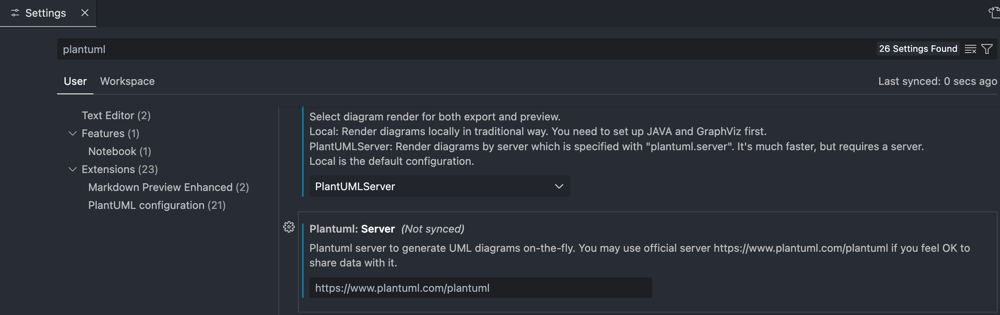

配置完成之后，新建立一个文件：*HelloUML.puml*, 并输入下面的内容，之后***Ctrl + Shift + P***, 输入*PlantUML*, 点击*Preview Current Diagram*即可预览相关的图，可以简单测试一下环境是否正常。

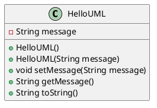

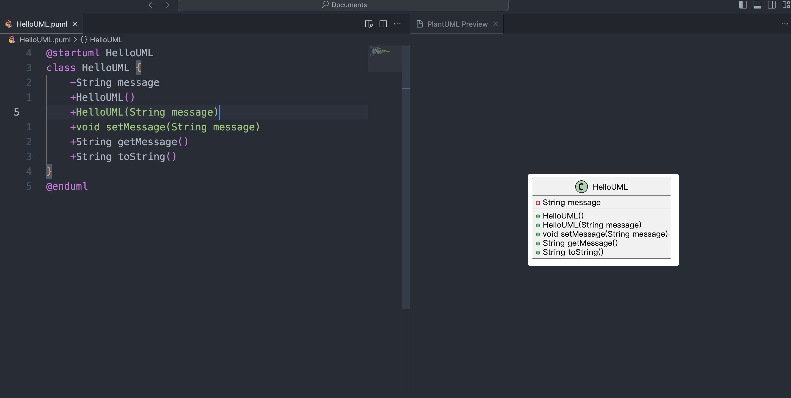

其中关于PlantUML的选项，其中有导出图(建议选择svg格式)或者生成链接等等，看自己需求。

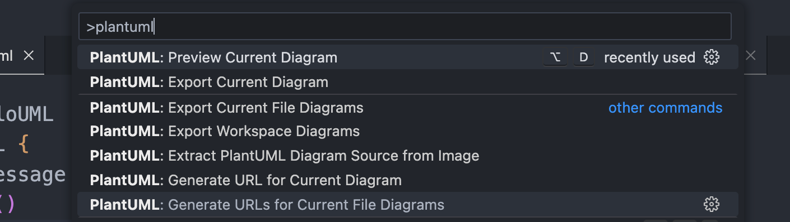

# 3. 类图绘制

PlantUML当中关于元素的声明，最常使用的无非就是***class, interface, enum, abstract class***等

其中简单的语法为：

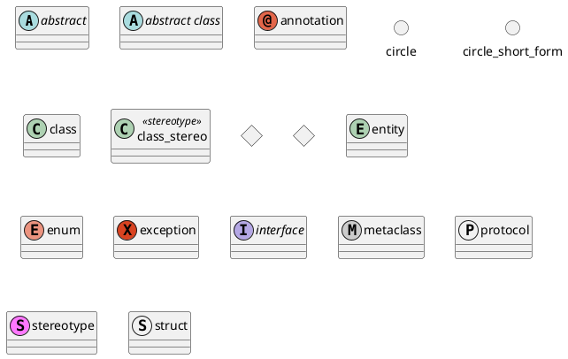

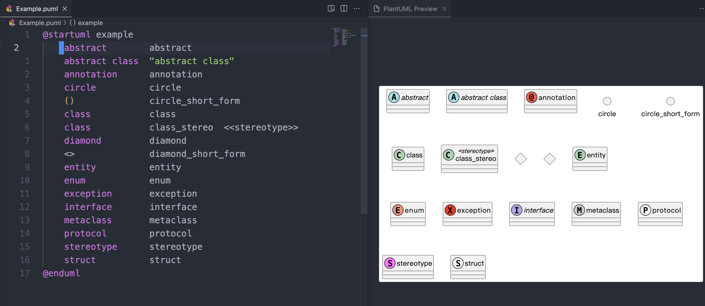

## 3.1 声明类成员

```
@startuml classtest
class MyClass {
    --fields--
    - int privateField
    # protectedField: String
    + publicField: boolean
    ~ packageField: double
    --functions(C++)--
    # string protectedMethod()
    + void publicMethod()
    --function(Delphi)--
    - function privateMethod(): Boolean;
    ~ procedure packageMethod();
    --properties(Delphi)--
    + property Data: string read privateField
}
@enduml
```

其中关于成员变量的声明，类型和变量名称的位置没有要求，根据自己的语言来放置。关于函数的声明，你需要书写`()`符号来告知渲染引擎它是一个函数，关于属性的声明也是同样的道理。

关于可见域的设置：

| **字符** | **图标(属性)**                                             | **图标(方法)**                                              | **可访问性**               |
| -------- | ---------------------------------------------------------- | ----------------------------------------------------------- | -------------------------- |
| `-`      |          |          | `private` 私有             |
| `#`      |        |        | `protected` 受保护         |
| `~`      |  |  | `package private` 包内可见 |
| `+`      |           |           | `public` 公有              |

## 3.1 类之间的关系

> 我们在绘制UML图的时候最头疼的可能就是关于类之间的关系使用什么线来连接的问题了。
>
> 我一度也是分不清楚，知道看到这篇文章：[看懂UML类图和时序图](https://design-patterns.readthedocs.io/zh-cn/latest/read_uml.html)，我才慢慢懂得使用什么线来绘制。***我往常的做法是通过这篇文章来找到继承关系使用什么线来绘制，之后去PlantUML官网上去寻找相应的代码表示。***

例如，泛化关系使用什么类型的线段？通过[看懂UML类图和时序图](https://design-patterns.readthedocs.io/zh-cn/latest/read_uml.html)得知使用下面的线段：

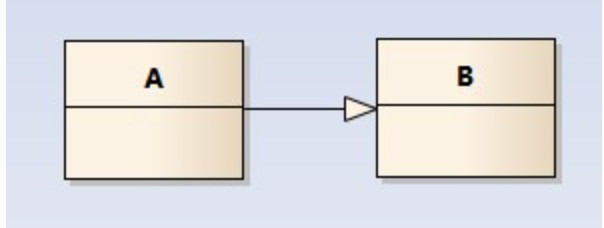

接着去[官网](https://plantuml.com/zh/class-diagram#9dd2a6eca0c2a0e7)来查找如何书写该类型的线段：

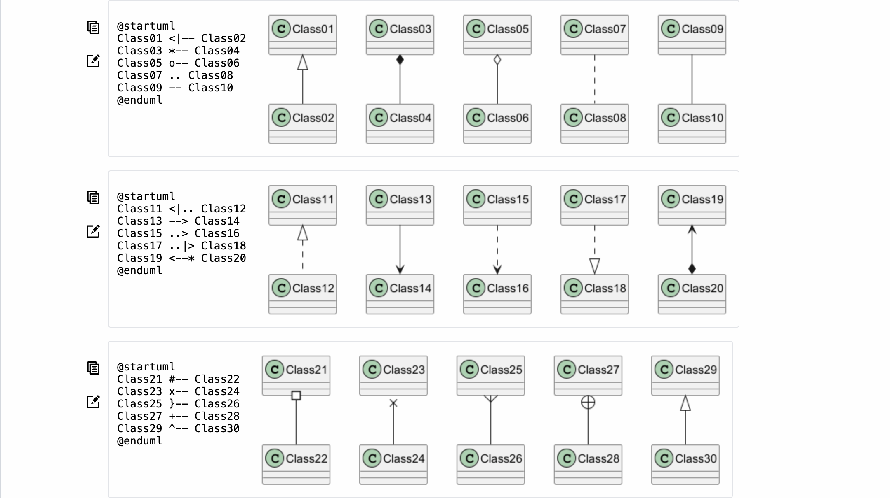

以上基本上就是我当初接触PlantUML一整个大致的绘制过程，这些会随着我们的使用时间的增加会慢慢的变得熟练。秉承着授人以鱼不如授人以渔的理念，我将我当初接触PlantUML一整个流程大致讲了一下，其余就是你去具体的实践喽！下面会讲一些进阶的绘制方式！

## 3.2 多个文件的使用

有的时候，我们会遇到学习一些代码量十分大的项目，尤其是进入公司接触到的公司的代码。这个时候，如果我们一股脑的在一个文件当中一直添加一个类，会导致这个文件里面的代码十分的多，对于我们后续的关于PlantUML的维护也会变得十分困难。所以，一般遇到十分多的代码是可以将其分为多个文件来进行编写的，之后在另外一个文件当中引入即可。***就像C++当中，你总不能将所有的代码放在一个文件当中吧！***

你只需要在代码当中引入相应的文件即可，渲染的结果如图所示。

```plantuml
@startuml MultiFiles
  !include ClassTest.puml
  !include Example.puml
  MyClass *-- Example
@enduml
```

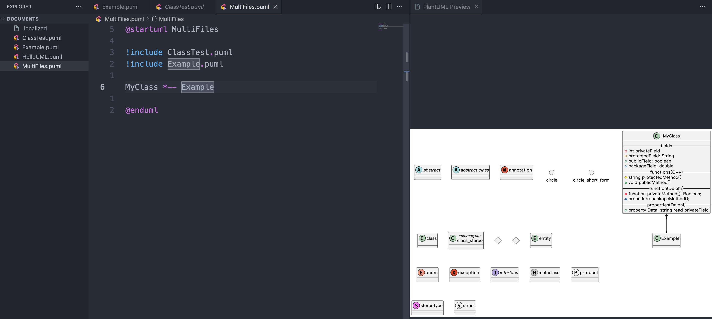

## 3.3 命名空间的使用

如果你是写C++的话，你应该会明白命名空间的重要性。PlantUML当中也是支持命名空间，这样既可以项目的结构清晰，也可以在不同的命名空间当中使用相同的名字。

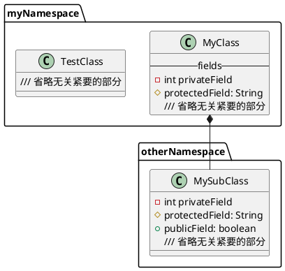

如图所示，这样书写既美观又结构清晰！

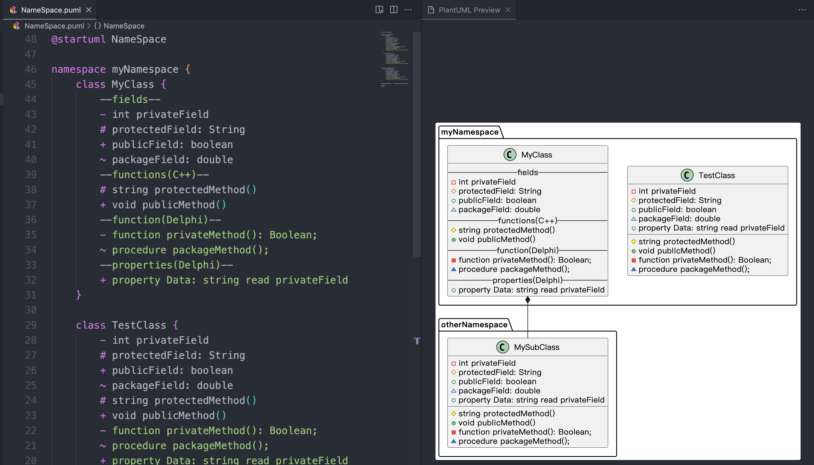

## 3.4 包(package)的使用

关于包的话，包的大致作用应该是这个包的大致功能是什么？这个包里面的这些类究竟做了什么？

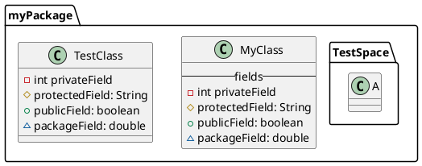

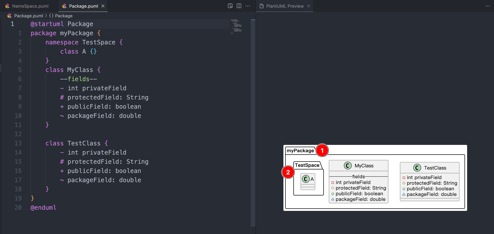

> [!NOTE]
>
> 注意图当中1和2之间的区别哦！


